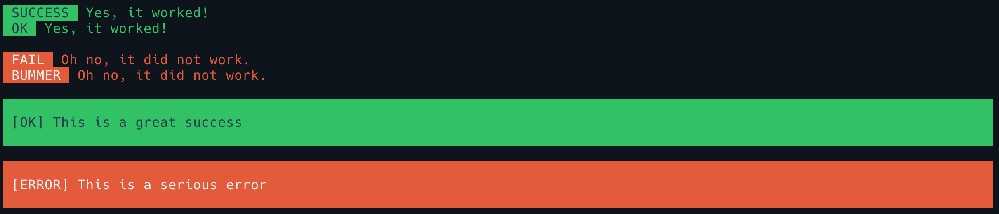

# Fancy Console for Laravel

[](https://twitter.com/kielabokkie)
[](https://packagist.org/packages/kielabokkie/laravel-fancy-console)
[](LICENSE.md)

Fancy Console for Laravel provides a `FancyConsole` trait that gives you a few extra fancy styled console outputs to compliment the already useful default Laravel ones.

## Requirements

* PHP >= 7.2
* Laravel 5.8 and up

## Installation

Install the package via composer:

```bash
composer require kielabokkie/laravel-fancy-console
```

## Usage

Firstly you'll have to add the `FancyConsole` trait to your command:

```php
<?php

namespace App\Console\Commands;

use Illuminate\Console\Command;
use Kielabokkie\FancyConsole\Traits\FancyConsole;

class MyCommand extends Command
{
    use FancyConsole;
}
```

### Success and fail messages

To make it easier to style success and fail messages you will have access to the following methods:

```php
$this->success('Yes, it worked!');
$this->success('Yes, it worked!', 'OK');

$this->fail('Oh no, it did not work.');
$this->fail('Oh no, it did not work.', 'BUMMER');

$this->successBlock('This is a great success');

$this->errorBlock('This is a serious error');
```

Which gives you the following output:



### Loading indicator

Laravel already comes with an easy progress bar but if you want to show progress in a different way you can use the dot loading indicator:

```php
for ($i = 0; $i < 100; $i++) {
    $this->dot();
}
```

The code above will output 100 dots on the same line. If you want to restrict the number of dots on a line you can set the dot width:

```php
$this->setDotWidth(40);

for ($i = 0; $i < 100; $i++) {
    $this->dot();
}
```

Now it will jump to the next line once the number of dots reach a multiple of 40.

If you know the total number of loading dots your command will be outputting you can set the total dots and the output will show you the current progress and total per line.

```php
$dotTotal = 100;

$this->setDotTotal($dotTotal);
$this->setDotWidth(40);

for ($i = 0; $i < $dotTotal; $i++) {
    $this->dot();
}
```

Lastly, if you would like to use a different character instead of a dot, you can pass it as a parameter:

```php
$this->dot('-');
```
